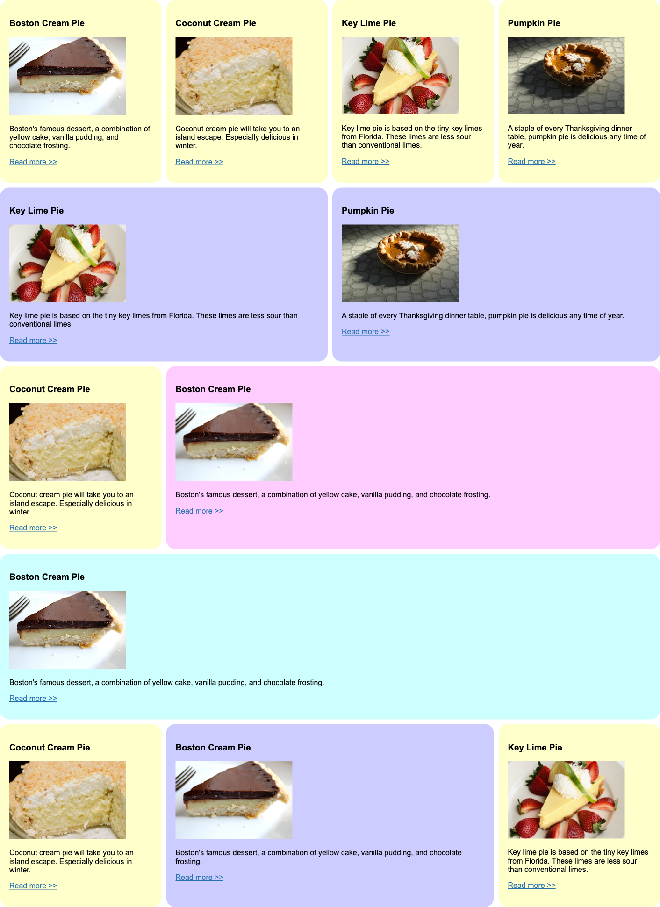
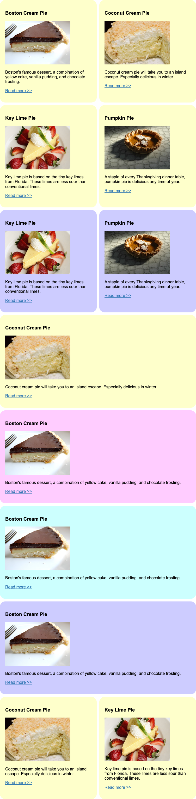

# CSS Grid Example

This project is a great example of CSS Grid, inspired by Jen Kramer’s course on Front End Master. It showcases how Grid can be effectively used to create responsive and flexible layouts in web design.

## Features

- Responsive design utilizing CSS Grid
- Clean and modern layout
- Updated card radius and padding compared to Jen Kramer's original design

## Visual Design

Below are visual representations of the webpage across different devices:

### Desktop

### Tablet

### Mobile

## Getting Started

To view the webpage locally, follow these steps:

1. Clone the repository or download the project files.
2. Open the `index.html` file in your web browser.
3. Explore the layout and design!

## Technologies Used

- HTML5
- CSS3 (Grid)

## Acknowledgments

- Special thanks to Jen Kramer for the insightful course that inspired this project.
